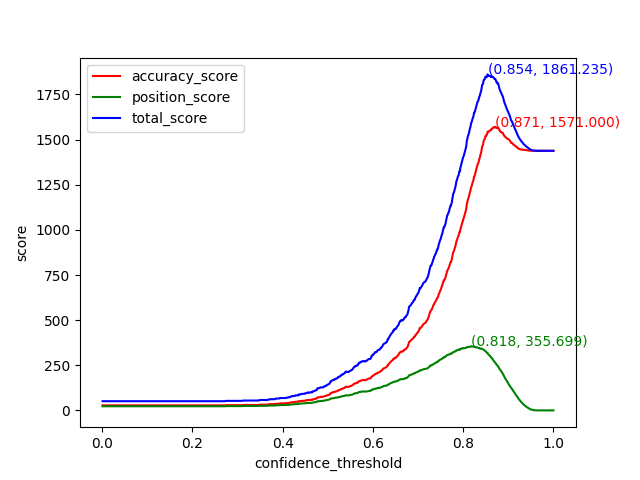

# GPT zero-shot baseline
## 1. 再現
作成者実行環境  
- Python 3.9.13  


### 1.1. 環境構築
1. pytorchを入れる
2. 他のライブラリを入れる
    ```
    pip install -r requirements.txt
    ```

### 1.2. 学習データで推論
ここでは最適な確信度のしきい値を求めることを目的とする

#### 1.2.1. データ用意
ここではAI王公式配布データセットの学習データversion2.0の一部を使用 (後述のSignateCLIから第4回用のDevセットも取得可能)
1. データ取得
   ```
   wget https://jaqket.s3.ap-northeast-1.amazonaws.com/data/aio_02/aio_02_train.jsonl -P datasets/aio2/
   ```
2. **4000件サンプリング**
   ```
   python datasets/aio2/preprocess.py --original_path datasets/aio2/aio_02_train.jsonl --n_samples 4000
   ```

#### 1.2.2. しきい値探し
1. 以下の環境変数を追加
   ```
   export TOKENIZERS_PARALLELISM=false
   ```
2. 推論: 結果は outputs/{date}/{time}/train.jsonl に出力される
   ```
   python main.py model=rinna-1b dataset=aio2_v1.0
   ```
3. しきい値探し
   ```
   python find_threshold.py --prediction_file outputs/{date}/{time}/train.jsonl --gold_file datasets/aio2/aio_02_train_4000.jsonl --limit_num_wrong_answers 3
   ```

### 1.3. しきい値探し結果

- rinna-1b
  - 


#### 1.3.1. あるしきい値のときのスコアを計算したいとき
- しきい値を超えた場合のみ回答するようなjsonlファイルを作成する　（-> train_cleaned.jsonl ）
   ```
   python modules/clean_results.py --prediction_file outputs/{date}/{time}/train.jsonl --confidence_threshold 0.854
   ```
- スコア計算
   ```
   python modules/compute_score.py --prediction_file outputs/{date}/{time}/train_cleaned.jsonl --gold_file datasets/aio2/aio_02_train_4000.jsonl --limit_num_wrong_answers 3
   ```

### 1.4. リーダーボード用データで推論
#### 1.4.1. データ用意
- signateとのデータのやり取りを行うためのAPIトークンを取得する [参考](https://pypi.org/project/signate/)
   ```
   signate token --email=Signateアカウントのメールアドレス --password=Signateアカウントのパスワード
   ```
- コンペID確認 (SignateのコンペページURL末尾と同じで、1235)
   ```
   signate list
   ```
- データファイルIDの確認
  ```
  signate files 
  ```
- リーダーボード用問題をダウンロード
   ```
   signate download --competition-id=1235 --file-id=3801 --path=datasets/aio4_v1.0/
   ```


#### 1.4.2. 推論: 結果は outputs/{date}/{time}/dev_unlabeled_cleaned.jsonl に出力される
- prompt作成
  ```
  python datasets/aio4_v1.0/preprocess.py --original_path datasets/aio4_v1.0/aio_04_test_lb_unlabeled_v1.0.jsonl
  ```
- 推論
   ```
   python main.py model=rinna-1b model.confidence_threshold=0.854 dataset.phase=test_lb_unlabeled
   ```

- リーダーボードに提出するファイルは、拡張子がtxtである必要があるため、ファイル名を変更する
   ```
   cp outputs/{date}/{time}/test_lb_unlabeled_cleaned.jsonl outputs/{date}/{time}/test_lb_unlabeled_cleaned.txt
   ```

<!-- #### 1.4.3. 結果
| model | threshold | accuracy score | position score | total score|
| -  | -| -| -|  -- |
| rinna-1b| 0.865 | 166 | 15.348 | 181.348 |
| open-calm-1b| 0.781 | 80 | 2.149 | 82.149 |

##### 1.4.3.1. 参考
| model | threshold | accuracy score | position score | total score|
| -  | -| -| -|  -- |
| rinna-1b| 0.811 | 145 | 29.599 | 174.599 |
| open-calm-1b| 0.625 | 29 | 7.736 | 36.736 | -->


## 2. 参考
### 2.1. 主な引数選択肢

| 引数名                     | 型    | 選択肢                               |
| -------------------------- | ----- | ------------------------------------ |
| model                      | str   | rinna-1b (default) <br> open-calm-1b |
| model.confidence_threshold | float |                                    |
| dataset                    | str   | aio4_v1.0 (default) <br> aio2_v1.0   |


### 2.3. 最終評価用Dockerテスト
- ビルド
  ```
  docker build -t aio4-gpt-baseline .
  ```
- 実行
  ```
  docker run --gpus 1 --rm -p 8000:8000 aio4-gpt-baseline
  ```
- 外からAPIで呼び出し
  ```
  python -m evaluate_docker_api \
  --test_unlabelded_file datasets/aio4_v1.0/aio_04_test_lb_unlabeled_v1.0.jsonl \
  --output_prediction_file datasets/aio4_v1.0/aio_04_test_lb_prediction_v1.0.jsonl
  ```